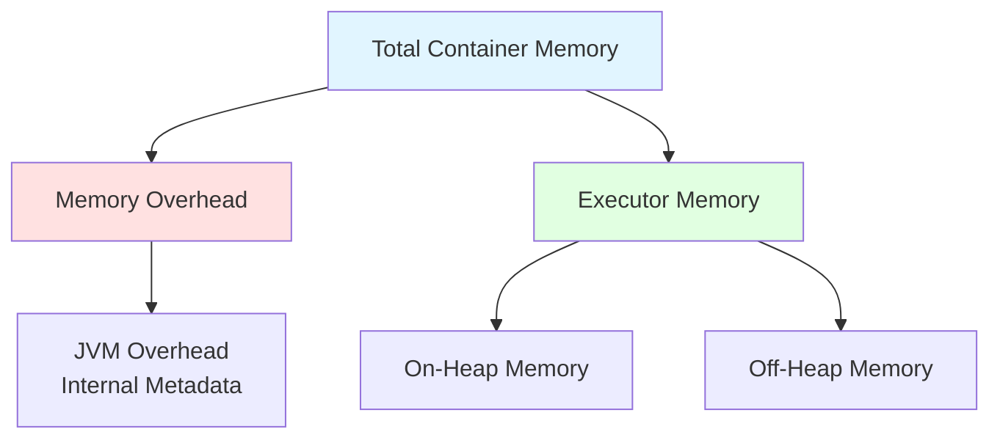
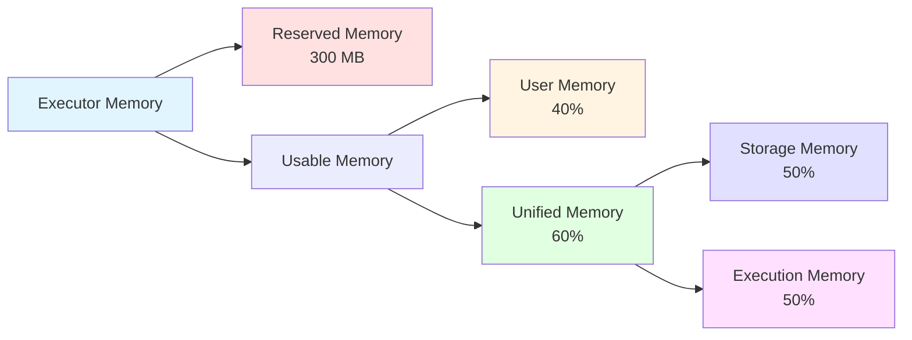
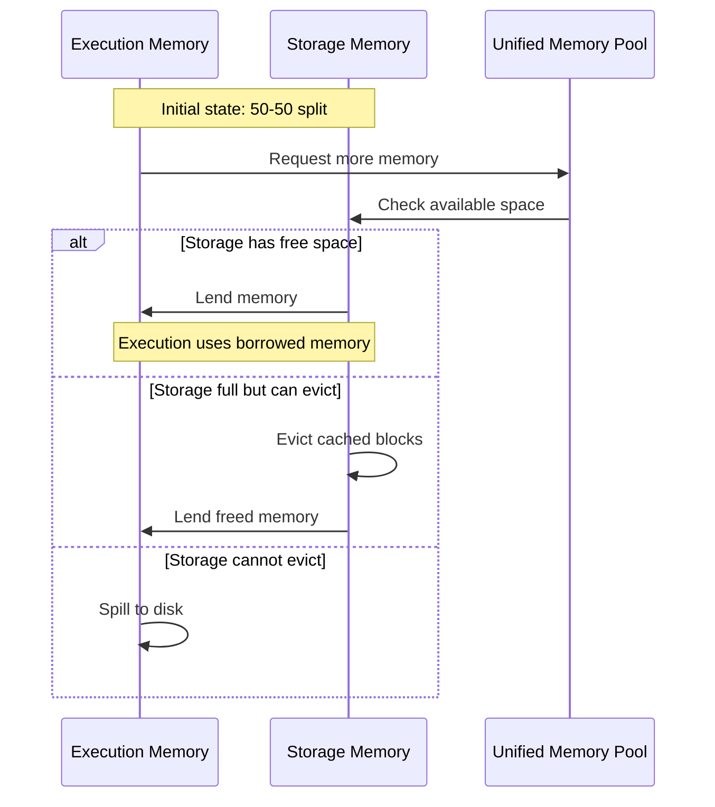
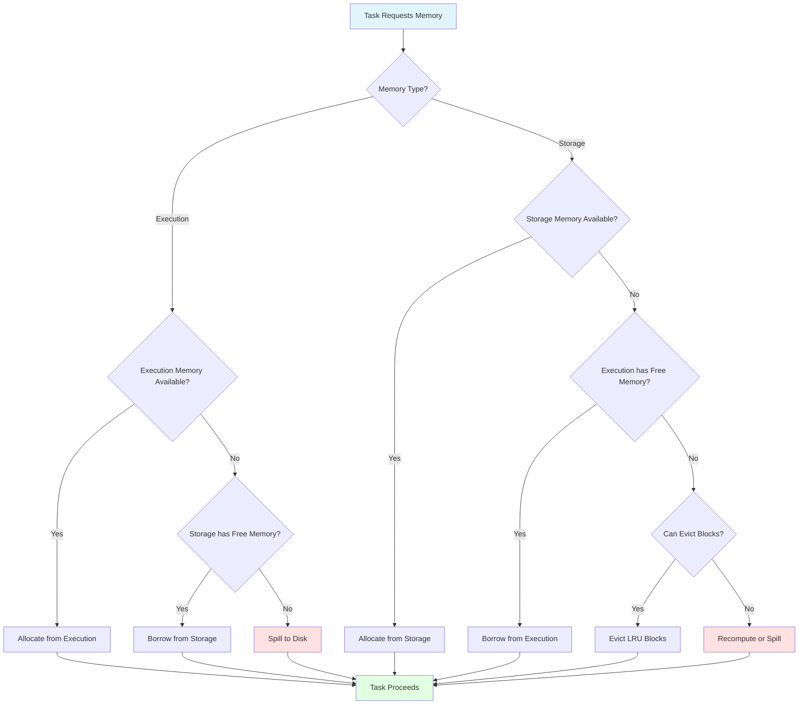

Apache Spark's performance heavily relies on how efficiently it manages memory across distributed executors. Unlike traditional disk-based systems, Spark leverages in-memory computing to achieve orders of magnitude faster processing speeds. However, this power comes with the complexity of managing memory carefully to avoid bottlenecks, out-of-memory errors, and performance degradation. Understanding how Spark allocates and manages memory is crucial for building robust and efficient big data applications.

## The importance of memory in Spark

One of the key reasons Spark revolutionized big data processing is its ability to keep data in memory rather than constantly writing to and reading from disk. The speed difference is dramatic: a CPU can read data from memory at approximately **10 GB/s**, while reading from regular hard disks drops to about **100 MB/s**, and even SSDs only reach around **600 MB/s**. Network transfers further reduce this to roughly **125 MB/s**.

<figure class="align-center">
  
  <figcaption>Data access speeds: Memory vs Disk vs Network.</figcaption>
</figure>

This performance advantage makes memory management not just an optimization concern, but a fundamental aspect of Spark application design.

## Executor memory architecture

In Apache Spark 3.5.x, each executor's memory is divided into several distinct regions, each serving specific purposes. Understanding this architecture is the foundation for optimizing Spark applications.

### Memory overhead

Before Spark can use memory for its operations, it must reserve a portion for the **memory overhead**. This overhead is used for internal metadata, user-defined data structures, and safeguards against memory pressure from the underlying operating system.

The formula for calculating memory overhead is:

$$
\text{Memory Overhead} = \max(\text{Executor Memory} \times 0.1, 384\text{ MB})
$$

For example:
- If executor memory is **5 GB**: overhead = max(5120 MB × 0.1, 384 MB) = **512 MB**
- If executor memory is **1 GB**: overhead = max(1024 MB × 0.1, 384 MB) = **384 MB**

This overhead can be explicitly configured using the `spark.executor.memoryOverhead` parameter, which is particularly important for applications with large data structures or when using external libraries.



### On-heap vs off-heap memory

Spark supports two types of memory allocation:

- **On-heap memory**: Managed by the Java Virtual Machine (JVM). This is the default and most commonly used memory type. It's subject to Java garbage collection, which can introduce pauses in processing.

- **Off-heap memory**: Allocated outside the JVM heap using Java's `sun.misc.Unsafe` API. This memory is not subject to garbage collection, potentially offering more predictable performance for certain workloads. It can be enabled with `spark.memory.offHeap.enabled=true`.

## Unified memory management

Since Spark 1.6, the platform uses **Unified Memory Management**, which replaced the older Static Memory Management model. This unified approach dynamically shares memory between execution and storage, making it more flexible and efficient.

### Memory regions breakdown

The available executor memory (after overhead) is divided into several regions:



#### 1. Reserved memory

A fixed **300 MB** is reserved for Spark's internal objects and system operations. This ensures that Spark has enough space to function even under memory pressure. The remaining memory after this reservation is called **usable memory**.

$$
\text{Usable Memory} = \text{Executor Memory} - 300\text{ MB}
$$

#### 2. User memory

Controlled by the `spark.memory.fraction` parameter (default: **0.6**), user memory accounts for the remaining fraction after the unified memory region. With the default setting, **40%** of usable memory is allocated to user memory.

$$
\text{User Memory} = \text{Usable Memory} \times (1 - \text{spark.memory.fraction})
$$

User memory stores:
- **RDD transformation metadata**: Information about dependencies between RDDs
- **User-defined data structures**: Custom objects created in user code
- **Internal Spark metadata**: Information needed for lineage tracking

#### 3. Unified memory region

The unified memory region, accounting for **60%** of usable memory by default, is shared between storage and execution. This is where Spark's dynamic memory management shines.

$$
\text{Unified Memory} = \text{Usable Memory} \times \text{spark.memory.fraction}
$$

This region is further divided between storage and execution memory.

### Storage memory

Storage memory is used for:
- **Cached/persisted RDDs**: When you call `cache()` or `persist()` on an RDD or DataFrame
- **Broadcast variables**: Shared read-only data distributed to all executors
- **Unroll memory**: Temporary space to deserialize serialized blocks

The initial split between storage and execution is controlled by `spark.memory.storageFraction` (default: **0.5**), meaning each gets 50% of the unified memory region initially.

### Execution memory

Execution memory is used for:
- **Shuffle operations**: Data redistribution across partitions
- **Joins**: Hash tables for join operations
- **Sorts**: Temporary buffers for sorting
- **Aggregations**: Data structures for grouping and aggregating

### Dynamic memory borrowing

The beauty of unified memory management is its dynamic nature. When one region needs more memory and the other has free space, borrowing can occur:



**Key rules**:
1. **Execution can borrow from storage**: If storage memory has free space, execution can use it
2. **Storage can borrow from execution**: If execution memory is free, storage can use it
3. **Execution memory cannot be evicted**: When storage needs memory back, it cannot forcibly take it from execution. Execution tasks must complete or spill to disk
4. **Storage memory can be evicted**: Cached blocks can be removed (using LRU policy) to free up space for execution

This asymmetry exists because execution operations are part of active computations that cannot be interrupted, while cached data can be recomputed if needed.

## Memory management strategies

### Dealing with memory pressure

When executors run low on memory, Spark employs several strategies:

#### Spilling to disk

When execution memory is insufficient, Spark spills data to disk. This involves:
1. Serializing in-memory data
2. Writing it to local disk storage
3. Reading it back when needed

While spilling prevents out-of-memory errors, it significantly impacts performance. Monitor spill metrics in the Spark UI to identify when this occurs.

#### Cache eviction

Storage memory uses a **Least Recently Used (LRU)** policy to evict cached blocks when space is needed. Evicted blocks can be:
- **Recomputed**: Using the RDD lineage if memory persistence was used
- **Read from disk**: If disk persistence was used

### Memory tuning parameters

Key configuration parameters for memory tuning:

```scala
// Fraction of executor memory allocated to unified region
spark.memory.fraction = 0.6  // 60% default

// Fraction of unified memory for storage
spark.memory.storageFraction = 0.5  // 50% default

// Enable off-heap memory
spark.memory.offHeap.enabled = false
spark.memory.offHeap.size = 0

// Executor memory overhead
spark.executor.memoryOverhead = [auto-calculated]

// Total executor memory
spark.executor.memory = 1g
```

## Practical memory optimization

### Calculating optimal executor memory

Consider a scenario where you have a cluster with:
- **Worker nodes**: 10 nodes
- **Cores per node**: 16 cores
- **Memory per node**: 64 GB

A reasonable configuration might be:

```
spark.executor.cores = 4
spark.executor.memory = 12g
spark.executor.instances = 40  # (10 nodes × 16 cores) / 4 cores per executor
```

With 12 GB executor memory:
- Memory overhead: max(12288 MB × 0.1, 384 MB) = **1229 MB**
- Available executor memory: **10,771 MB**
- Reserved memory: **300 MB**
- Usable memory: **10,471 MB**
- User memory (40%): **4,188 MB**
- Unified memory (60%): **6,283 MB**
  - Initial storage: **3,141 MB**
  - Initial execution: **3,141 MB**

### Common memory issues and solutions

#### OutOfMemoryError

**Symptoms**: Executors failing with OOM errors

**Solutions**:
1. Increase `spark.executor.memory`
2. Increase `spark.executor.memoryOverhead`
3. Reduce `spark.executor.cores` (fewer concurrent tasks per executor)
4. Increase number of partitions to reduce per-task memory
5. Avoid wide transformations that require large shuffles

#### Excessive spilling

**Symptoms**: Poor performance, high disk I/O in Spark UI

**Solutions**:
1. Increase `spark.executor.memory`
2. Reduce caching if execution memory is more critical
3. Increase shuffle partitions: `spark.sql.shuffle.partitions`
4. Use more efficient serialization (Kryo instead of Java)

#### GC overhead limit exceeded

**Symptoms**: Executors spending too much time in garbage collection

**Solutions**:
1. Increase executor memory
2. Tune JVM GC parameters
3. Use off-heap memory for large data structures
4. Reduce object creation in user code
5. Use primitive types instead of objects where possible

### Best practices checklist

✓ **Partition appropriately**: Ensure at least 2-3 partitions per CPU core for parallelism

✓ **Filter early**: Reduce data volume as early as possible in your pipeline

✓ **Cache wisely**: Only cache data that will be reused multiple times

✓ **Choose storage levels carefully**:
  - `MEMORY_ONLY`: Fast but risky if data doesn't fit
  - `MEMORY_AND_DISK`: Safe default with spilling
  - `MEMORY_ONLY_SER`: Save memory with serialization overhead
  - `OFF_HEAP`: Predictable performance, no GC pressure

✓ **Monitor memory usage**: Use Spark UI to track:
  - Memory usage per executor
  - Spill metrics (memory and disk)
  - GC time
  - Task serialization time

✓ **Avoid shuffle when possible**: Use broadcast joins for small tables

✓ **Use appropriate data formats**: Parquet and ORC offer better compression and columnar storage

## Memory management flow

The complete memory management decision flow in Spark:



## Conclusion

Understanding Spark's memory management is essential for building efficient distributed applications. The unified memory management model in Spark 3.5.x provides flexibility through dynamic memory sharing, but it requires careful configuration and monitoring to achieve optimal performance.

Key takeaways:
- Memory speed is critical to Spark's performance advantage
- Unified memory management dynamically shares resources between storage and execution
- Execution memory cannot be evicted, but storage memory can
- Proper sizing of executors and partitions prevents memory issues
- Monitoring and tuning are essential for production workloads

By mastering these concepts and following best practices, you can build Spark applications that efficiently utilize cluster resources while avoiding common pitfalls like out-of-memory errors and excessive disk spilling.

## References

1. Apache Software Foundation. (2024). *Apache Spark Configuration*. Retrieved from [https://spark.apache.org/docs/3.5.0/configuration.html](https://spark.apache.org/docs/3.5.0/configuration.html)

2. Apache Software Foundation. (2024). *Tuning Spark - Memory Management*. Retrieved from [https://spark.apache.org/docs/3.5.0/tuning.html#memory-management-overview](https://spark.apache.org/docs/3.5.0/tuning.html#memory-management-overview)

3. Sekar, T. K. (2020). *Spark Memory Management*. Analytics Vidhya. Retrieved from [https://medium.com/analytics-vidhya/spark-memory-management-583a16c1253f](https://medium.com/analytics-vidhya/spark-memory-management-583a16c1253f)

4. Databricks. (2024). *Best Practices for Apache Spark Performance Tuning*. Databricks Documentation. Retrieved from [https://docs.databricks.com/optimizations/index.html](https://docs.databricks.com/optimizations/index.html)

5. Zaharia, M., et al. (2016). *Apache Spark: A Unified Engine for Big Data Processing*. Communications of the ACM, 59(11), 56-65.

6. Apache Software Foundation. (2024). *RDD Programming Guide*. Retrieved from [https://spark.apache.org/docs/3.5.0/rdd-programming-guide.html#rdd-persistence](https://spark.apache.org/docs/3.5.0/rdd-programming-guide.html#rdd-persistence)

7. Karau, H., & Warren, R. (2017). *High Performance Spark: Best Practices for Scaling and Optimizing Apache Spark*. O'Reilly Media.
