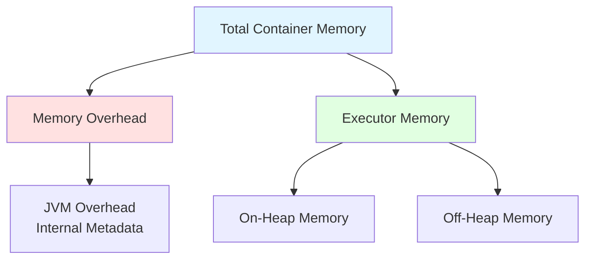
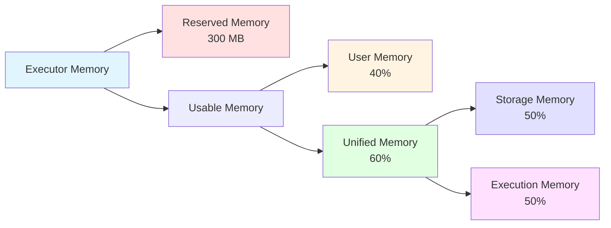
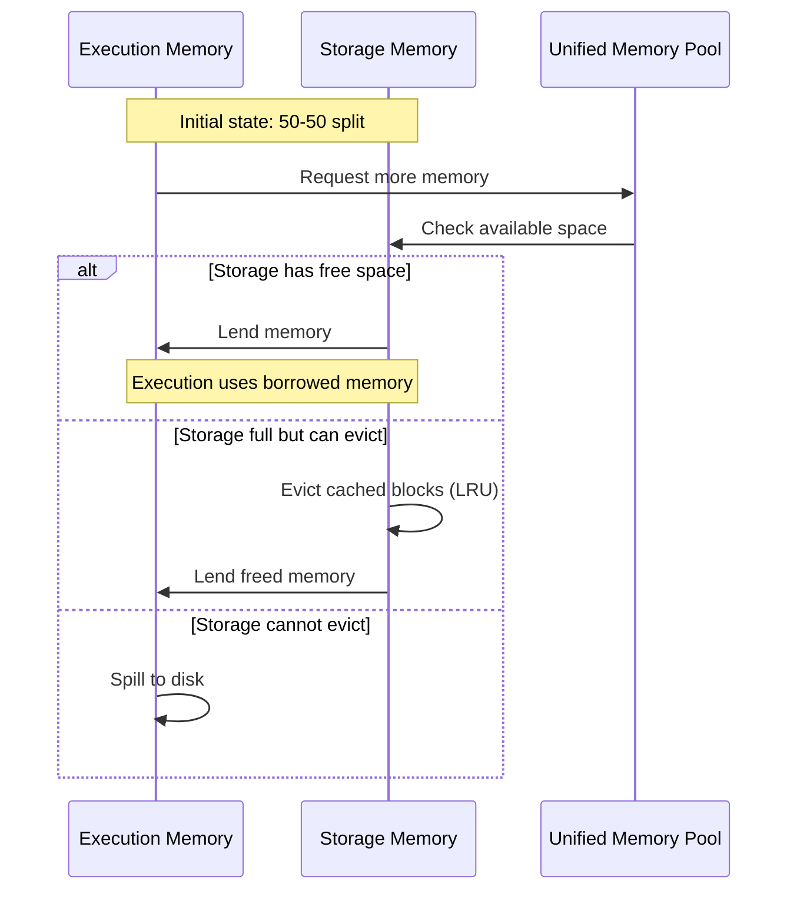
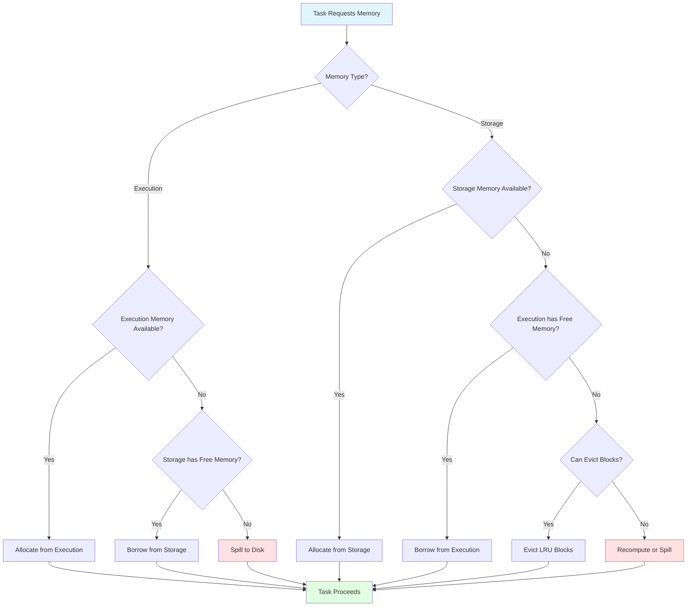

Apache Spark's performance heavily relies on how efficiently it manages memory across distributed executors. Unlike traditional disk-based systems, Spark leverages in-memory computing to achieve orders of magnitude faster processing speeds. However, this power comes with the complexity of managing memory carefully to avoid bottlenecks, out-of-memory errors, and performance degradation. Understanding how Spark allocates and manages memory is crucial for building robust and efficient big data applications.

## Memory management hierarchy

Before diving into the details, it's important to understand that memory management in Spark operates at multiple levels:

1. **Operating System level**: Physical RAM management and virtual memory
2. **Cluster Manager level** (YARN/Kubernetes/Mesos): Container resource allocation
3. **JVM level**: Heap management and garbage collection
4. **Spark level**: Unified memory management within executors

Each level has its own abstractions and constraints. When you configure Spark memory settings, you're primarily working at the Spark and JVM levels, but these decisions cascade through the entire stack. Understanding this hierarchy helps explain why memory issues can manifest in different ways.

## The importance of memory in Spark

One of the key reasons Spark revolutionized big data processing is its ability to keep data in memory rather than constantly writing to and reading from disk. The speed difference is dramatic: a CPU can read data from memory at approximately **10 GB/s**, while reading from regular hard disks drops to about **100 MB/s**, and even SSDs only reach around **600 MB/s**. Network transfers further reduce this to roughly **125 MB/s**.

<figure class="align-center">
  
  <figcaption>Data access speeds: Memory vs Disk vs Network.</figcaption>
</figure>

This performance advantage makes memory management not just an optimization concern, but a fundamental aspect of Spark application design.

## Executor memory architecture

In Apache Spark 3.5.x, each executor's memory is divided into several distinct regions, each serving specific purposes. Understanding this architecture is the foundation for optimizing Spark applications.

When Spark runs on cluster managers like YARN or Kubernetes, it requests containers to execute work. Each executor runs as a separate **JVM process** within these containers, and understanding how memory is allocated within these boundaries is crucial for effective resource management.

### Memory overhead

Before Spark can use memory for its operations, it must reserve a portion for the **memory overhead**. This overhead is used for:
- **VM overheads**: JVM internal operations
- **Interned strings**: String pool memory
- **Native overheads**: Non-JVM operations
- **PySpark executors**: Python process memory when using PySpark (if `spark.executor.pyspark.memory` is not configured)
- **Other non-executor processes**: Additional processes running in the same container

The formula for calculating memory overhead is:

$$
\text{Memory Overhead} = \max(\text{Executor Memory} \times 0.1, 384\text{ MB})
$$

For example:
- If executor memory is **5 GB**: overhead = max(5120 MB × 0.1, 384 MB) = **512 MB**
- If executor memory is **1 GB**: overhead = max(1024 MB × 0.1, 384 MB) = **384 MB**

This overhead can be explicitly configured using the `spark.executor.memoryOverhead` parameter (or the deprecated `spark.yarn.executor.memoryOverhead` for YARN). Starting from Spark 3.0, this memory does **not** include off-heap memory, which is calculated separately.

The total memory requested from the cluster manager is:

$$
\text{Total Container Memory} = \text{Executor Memory} + \text{Memory Overhead} + \text{Off-Heap Memory} + \text{PySpark Memory}
$$



### On-heap vs off-heap memory

Spark supports two types of memory allocation:

- **On-heap memory**: Managed by the Java Virtual Machine (JVM). This is the default and most commonly used memory type. It's subject to Java garbage collection, which can introduce pauses in processing.

- **Off-heap memory**: Allocated outside the JVM heap using Java's `sun.misc.Unsafe` API. This memory is not subject to garbage collection, potentially offering more predictable performance for certain workloads. It can be enabled with `spark.memory.offHeap.enabled=true`.

## Unified memory management

Since Spark 1.6, the platform uses **Unified Memory Management**, which replaced the older Static Memory Management model. This unified approach dynamically shares memory between execution and storage, making it more flexible and efficient.

### Evolution from StaticMemoryManager

Before Spark 1.6, memory management was handled by **StaticMemoryManager**, which used fixed boundaries between storage and execution memory. This approach had significant limitations:
- Storage and execution memory had fixed sizes defined at startup
- No dynamic borrowing—memory regions couldn't share unused space
- Often led to inefficient memory utilization (one region could be starved while another had plenty of free space)
- Required manual tuning of separate parameters for different workloads

The **UnifiedMemoryManager**, introduced in Spark 1.6, addresses these issues through dynamic memory sharing. While you can still enable the legacy mode with `spark.memory.useLegacyMode=true`, this is strongly discouraged and exists only for backward compatibility with older applications.

### Memory regions breakdown

The available executor memory (after overhead) is divided into several regions:



#### 1. Reserved memory

A fixed **300 MB** is reserved for Spark's internal objects and system operations. This value is hardcoded in the Spark source code (as `RESERVED_SYSTEM_MEMORY_BYTES`) and ensures that Spark has enough space to function even under memory pressure. This memory stores Spark's internal objects and guarantees sufficient memory for the system even with small JVM heaps.

**Important**: If the executor memory is less than **1.5 times the reserved memory** (i.e., less than 450 MB), Spark will fail with a "please use larger heap size" error message. This is a safety mechanism to ensure executors have sufficient memory to operate.

The remaining memory after this reservation is called **usable memory**:

$$
\text{Usable Memory} = \text{Executor Memory} - 300\text{ MB}
$$

In test environments (when `spark.testing` is set), you can modify this value with `spark.testing.reservedMemory`, but this is not recommended for production use.

#### 2. User memory

Controlled by the `spark.memory.fraction` parameter (default: **0.6**), user memory accounts for the remaining fraction after the unified memory region. With the default setting, **40%** of usable memory is allocated to user memory.

$$
\text{User Memory} = \text{Usable Memory} \times (1 - \text{spark.memory.fraction})
$$

User memory is a completely **unmanaged** memory region from Spark's perspective. It stores:
- **RDD transformation metadata**: Information about dependencies between RDDs and lineage
- **User-defined data structures**: Custom objects created in user code
- **UDFs (User-Defined Functions)**: Memory used by custom functions
- **Internal Spark metadata**: Information needed for tracking RDD lineage

This memory segment is **not managed by Spark**. Spark makes no accounting of what you store here or whether you respect the boundary. It's entirely up to the developer to manage this space efficiently. If you exceed this memory, you'll encounter `OutOfMemoryError` exceptions, as Spark cannot help with memory management in this region.

#### 3. Unified memory region

The unified memory region, accounting for **60%** of usable memory by default, is shared between storage and execution. This is where Spark's dynamic memory management shines.

$$
\text{Unified Memory} = \text{Usable Memory} \times \text{spark.memory.fraction}
$$

This region is further divided between storage and execution memory.

### Storage memory

Storage memory is used for:
- **Cached/persisted RDDs**: When you call `cache()` or `persist()` on an RDD or DataFrame
- **Broadcast variables**: Shared read-only data distributed to all executors (stored with `MEMORY_AND_DISK` persistence level)
- **Unroll memory**: Temporary space to deserialize serialized blocks into memory

The initial split between storage and execution is controlled by `spark.memory.storageFraction` (default: **0.5**), meaning each gets 50% of the unified memory region initially.

When storage memory needs to free up space, Spark uses a **Least Recently Used (LRU)** algorithm to evict cached blocks. The cost of eviction depends on the storage level:
- **`MEMORY_ONLY`**: Most expensive, as evicted data must be recomputed from the original source
- **`MEMORY_AND_DISK`**: Moderate cost, evicted blocks are written to disk and can be read back
- **`MEMORY_AND_DISK_SER`**: Least expensive, data is already serialized (compact format), only requiring disk I/O with minimal serialization overhead

### Execution memory

Execution memory is used for:
- **Shuffle operations**: Data redistribution across partitions, including shuffle intermediate buffers on the Map side
- **Joins**: Hash tables for join operations (especially hash joins)
- **Sorts**: Temporary buffers for sorting operations
- **Aggregations**: Data structures for grouping and aggregating (hash aggregation)

This pool supports **spilling to disk** when insufficient memory is available. However, unlike storage memory, blocks from execution memory **cannot be forcefully evicted** by other tasks. If execution memory is exhausted and cannot be borrowed from storage, Spark will spill data to disk to continue processing, which significantly impacts performance.

Most performance issues in Spark pipelines stem from insufficient execution memory, which leads to excessive disk spilling.

### Dynamic memory borrowing

The beauty of unified memory management is its dynamic nature. When one region needs more memory and the other has free space, borrowing can occur:



**Key borrowing rules**:
1. **Execution can borrow from storage**: If storage memory has free space, execution can use it without restrictions
2. **Storage can borrow from execution**: If execution memory is free, storage can use it
3. **Execution memory cannot be evicted**: When storage needs memory back, it **cannot** forcibly take it from execution. Storage must wait until execution tasks complete and release the borrowed memory
4. **Storage memory can be evicted**: Cached blocks can be removed (using LRU policy) to free up space for execution

This asymmetry exists because:
- **Execution operations** are part of active computations that cannot be interrupted without causing task failures
- **Cached data** can be recomputed from RDD lineage or read from disk if evicted, making it less critical

The Spark developers prioritized execution over storage because **task execution is more important than cached data**—the entire job can crash with an OOM error if execution runs out of memory, while evicted cache can be regenerated.

## Understanding blocks and BlockManager

At the physical level, data in Spark is organized into **blocks**. A block is the fundamental unit of data storage and transfer in Spark. Understanding blocks helps explain how memory management works in practice.

### What are blocks?

Blocks are transferable objects that serve multiple purposes:
- **Task inputs**: Data read by Spark tasks
- **Task outputs**: Results returned from tasks
- **Shuffle data**: Intermediate data during shuffle operations
- **Cached data**: Persisted RDDs and DataFrames
- **Broadcast variables**: Read-only shared data

### BlockManager: Spark's storage engine

The **BlockManager** is a key-value store that runs on every node in a Spark cluster (both driver and executors). It manages blocks and can store them:
- **In memory** (on-heap or off-heap)
- **On disk**
- **Locally** or fetch them **remotely** from other executors

The BlockManager enables **data locality** and **concurrency**. For example, if a block can be fetched from 4 different executors, Spark can read from all 4 in parallel, improving throughput significantly.

When blocks are evicted from memory, the BlockManager coordinates with the MemoryManager to determine which blocks to remove based on the LRU algorithm and the configured storage level.

## Task-level memory management

While the `MemoryManager` handles executor-level memory allocation, individual tasks need their own memory management to ensure fair resource distribution among concurrent tasks.

### TaskMemoryManager

**TaskMemoryManager** is responsible for managing memory at the task level. It sits between tasks and the `MemoryManager`, handling:
- **Memory acquisition**: Requesting memory from the MemoryManager on behalf of tasks
- **Memory release**: Returning memory when tasks complete
- **Accounting**: Tracking how much memory each task uses

### Memory allocation per task

A critical challenge in Spark is that tasks within an executor run as threads sharing the same JVM resources, including execution memory. Without proper isolation, the first task could consume all available memory, causing subsequent tasks to hang.

TaskMemoryManager solves this by limiting memory that can be allocated to each task:

$$
\frac{1}{2n} \leq \text{Task Memory} \leq \frac{1}{n}
$$

Where $n$ is the number of currently running tasks in the executor.

**Implication**: More concurrent tasks mean less memory per task. This is controlled by `spark.executor.cores`—fewer cores per executor means fewer concurrent tasks and more memory available to each task.

**Example**: If an executor has 4 GB of execution memory:
- With **2 concurrent tasks**: Each task gets between 1-2 GB
- With **4 concurrent tasks**: Each task gets between 0.5-1 GB
- With **8 concurrent tasks**: Each task gets between 0.25-0.5 GB

This dynamic allocation prevents memory starvation while allowing flexible resource utilization.

### Dealing with memory pressure

When executors run low on memory, Spark employs several strategies:

#### Spilling to disk

When execution memory is insufficient, Spark spills data to disk. This involves:
1. Serializing in-memory data
2. Writing it to local disk storage
3. Reading it back when needed

While spilling prevents out-of-memory errors, it significantly impacts performance. Monitor spill metrics in the Spark UI to identify when this occurs.

#### Cache eviction

Storage memory uses a **Least Recently Used (LRU)** policy to evict cached blocks when space is needed. Evicted blocks can be:
- **Recomputed**: Using the RDD lineage if memory persistence was used
- **Read from disk**: If disk persistence was used

### Memory tuning parameters

Key configuration parameters for memory tuning:

```scala
// Fraction of executor memory allocated to unified region
spark.memory.fraction = 0.6  // 60% default

// Fraction of unified memory for storage
spark.memory.storageFraction = 0.5  // 50% default

// Enable off-heap memory
spark.memory.offHeap.enabled = false
spark.memory.offHeap.size = 0

// Executor memory overhead
spark.executor.memoryOverhead = [auto-calculated]

// Total executor memory
spark.executor.memory = 1g
```

## Project Tungsten and memory optimization

**Project Tungsten** was introduced in Spark 1.4 as a major initiative to improve Spark's memory and CPU efficiency. It fundamentally changed how Spark manages memory and executes operations.

### Goals of Tungsten

1. **Explicit memory management**: Bypass JVM object overhead and garbage collection
2. **Binary processing**: Operate directly on binary data without deserialization
3. **Cache-aware computation**: Optimize algorithms for modern CPU cache hierarchies
4. **Code generation**: Generate optimized bytecode at runtime (whole-stage codegen)

### Memory management improvements

Even when using on-heap memory, Tungsten manages memory **explicitly** rather than relying on JVM automatic memory management. This provides several benefits:

**Reduced GC pressure**: Tungsten allocates large, long-lived memory regions that don't trigger frequent garbage collection. The JVM's GC primarily affects short-lived objects in the young generation, while Tungsten's allocations stay in the old generation.

**Compact binary format**: Tungsten uses custom **Encoders/Decoders** to represent JVM objects in a compact binary format. Instead of storing objects with their full Java overhead (headers, pointers, etc.), data is stored in a dense, columnar format.

**Direct memory operations**: When off-heap mode is enabled, Tungsten uses `sun.misc.Unsafe` to perform C-style memory operations, bypassing the JVM entirely for data storage.

### Tungsten and off-heap memory

When configured to use off-heap execution memory (via `spark.memory.offHeap.enabled=true`), Tungsten allocates data pages outside the JVM using native memory. This requires careful planning because:
- Container managers (YARN, Kubernetes) need to account for this additional memory
- All data page allocations must fit within the off-heap size limit (`spark.memory.offHeap.size`)
- Memory is not tracked by JVM tools like JConsole or VisualVM

### Benefits for DataFrames and Datasets

Tungsten's improvements are most visible when using **DataFrames** and **Datasets** (which use Spark SQL's Catalyst optimizer). RDD-based operations don't benefit as much from Tungsten optimizations because they work with arbitrary JVM objects rather than structured data.

## Memory management strategies

### Calculating optimal executor memory

Consider a scenario where you have a cluster with:
- **Worker nodes**: 10 nodes
- **Cores per node**: 16 cores
- **Memory per node**: 64 GB

A reasonable configuration might be:

```
spark.executor.cores = 4
spark.executor.memory = 12g
spark.executor.instances = 40  # (10 nodes × 16 cores) / 4 cores per executor
```

With 12 GB executor memory:
- Memory overhead: max(12288 MB × 0.1, 384 MB) = **1229 MB**
- Available executor memory: **10,771 MB**
- Reserved memory: **300 MB**
- Usable memory: **10,471 MB**
- User memory (40%): **4,188 MB**
- Unified memory (60%): **6,283 MB**
  - Initial storage: **3,141 MB**
  - Initial execution: **3,141 MB**

### Common memory issues and solutions

#### OutOfMemoryError

**Symptoms**: Executors failing with OOM errors

**Solutions**:
1. Increase `spark.executor.memory`
2. Increase `spark.executor.memoryOverhead`
3. Reduce `spark.executor.cores` (fewer concurrent tasks per executor)
4. Increase number of partitions to reduce per-task memory
5. Avoid wide transformations that require large shuffles

#### Excessive spilling

**Symptoms**: Poor performance, high disk I/O in Spark UI

**Solutions**:
1. Increase `spark.executor.memory`
2. Reduce caching if execution memory is more critical
3. Increase shuffle partitions: `spark.sql.shuffle.partitions`
4. Use more efficient serialization (Kryo instead of Java)

#### GC overhead limit exceeded

**Symptoms**: Executors spending too much time in garbage collection

**Solutions**:
1. Increase executor memory
2. Tune JVM GC parameters
3. Use off-heap memory for large data structures
4. Reduce object creation in user code
5. Use primitive types instead of objects where possible

### Best practices checklist

✓ **Partition appropriately**: Ensure at least 2-3 partitions per CPU core for parallelism

✓ **Filter early**: Reduce data volume as early as possible in your pipeline

✓ **Cache wisely**: Only cache data that will be reused multiple times

✓ **Choose storage levels carefully**:
  - `MEMORY_ONLY`: Fast but risky if data doesn't fit
  - `MEMORY_AND_DISK`: Safe default with spilling
  - `MEMORY_ONLY_SER`: Save memory with serialization overhead
  - `OFF_HEAP`: Predictable performance, no GC pressure

✓ **Monitor memory usage**: Use Spark UI to track:
  - Memory usage per executor
  - Spill metrics (memory and disk)
  - GC time
  - Task serialization time

✓ **Avoid shuffle when possible**: Use broadcast joins for small tables

✓ **Use appropriate data formats**: Parquet and ORC offer better compression and columnar storage

## Memory management flow

The complete memory management decision flow in Spark:



## Conclusion

Understanding Spark's memory management is essential for building efficient distributed applications. The unified memory management model in Spark 3.5.x provides flexibility through dynamic memory sharing, but it requires careful configuration and monitoring to achieve optimal performance.

### Key takeaways

- **Memory speed is critical**: In-memory computing provides 100x+ speedup over disk-based processing
- **Hierarchical management**: Memory is managed at multiple levels (OS, cluster manager, JVM, Spark)
- **Unified memory model**: Dynamic sharing between storage and execution memory since Spark 1.6
- **Asymmetric eviction**: Execution memory cannot be evicted, but storage memory can (for good reasons)
- **Block-based storage**: Data is organized into blocks managed by BlockManager for efficient caching and transfer
- **Task-level fairness**: TaskMemoryManager ensures concurrent tasks share memory fairly
- **Tungsten optimizations**: Explicit memory management and binary processing reduce GC pressure
- **Configuration matters**: Proper sizing of executors, partitions, and memory regions prevents bottlenecks
- **Monitor continuously**: Use Spark UI to track memory usage, spills, and GC time

### The path forward

Spark 2.x introduced the second-generation Tungsten engine with **whole-stage code generation** and **vectorized columnar execution**, further improving performance. Spark 3.x continued these enhancements with **Adaptive Query Execution (AQE)**, which dynamically adjusts execution plans based on runtime statistics.

Modern Spark applications benefit most from:
- Using DataFrame/Dataset APIs (not RDDs) to leverage Catalyst and Tungsten
- Enabling AQE for dynamic optimization
- Choosing appropriate file formats (Parquet, ORC) with efficient compression
- Monitoring and iterative tuning based on workload characteristics

By mastering these concepts and following best practices, you can build Spark applications that efficiently utilize cluster resources while avoiding common pitfalls like out-of-memory errors and excessive disk spilling. Memory management may seem complex, but understanding it unlocks Spark's true potential for processing massive datasets at scale.

## References

1. Apache Software Foundation. (2024). *Apache Spark Configuration*. Retrieved from [https://spark.apache.org/docs/3.5.0/configuration.html](https://spark.apache.org/docs/3.5.0/configuration.html)

2. Apache Software Foundation. (2024). *Tuning Spark - Memory Management*. Retrieved from [https://spark.apache.org/docs/3.5.0/tuning.html#memory-management-overview](https://spark.apache.org/docs/3.5.0/tuning.html#memory-management-overview)

3. Apache Software Foundation. (2024). *Spark Memory Management Source Code*. Retrieved from [https://github.com/apache/spark/tree/master/core/src/main/scala/org/apache/spark/memory](https://github.com/apache/spark/tree/master/core/src/main/scala/org/apache/spark/memory)

4. Sekar, T. K. (2020). *Spark Memory Management*. Analytics Vidhya. Retrieved from [https://medium.com/analytics-vidhya/spark-memory-management-583a16c1253f](https://medium.com/analytics-vidhya/spark-memory-management-583a16c1253f)

5. Suhas, N. M. (2020). *Apache Spark Memory Management*. Analytics Vidhya. Retrieved from [https://medium.com/analytics-vidhya/apache-spark-memory-management-49682ded3d42](https://medium.com/analytics-vidhya/apache-spark-memory-management-49682ded3d42)

6. Kirilenko, K. (2024). *Deep Dive into Spark Memory Management*. Luminous Men. Retrieved from [https://luminousmen.com/post/dive-into-spark-memory/](https://luminousmen.com/post/dive-into-spark-memory/)

7. Databricks. (2024). *Best Practices for Apache Spark Performance Tuning*. Databricks Documentation. Retrieved from [https://docs.databricks.com/optimizations/index.html](https://docs.databricks.com/optimizations/index.html)

8. Zaharia, M., Chowdhury, M., Franklin, M. J., Shenker, S., & Stoica, I. (2010). *Spark: Cluster Computing with Working Sets*. In Proceedings of the 2nd USENIX Workshop on Hot Topics in Cloud Computing (HotCloud '10).

9. Zaharia, M., et al. (2012). *Resilient Distributed Datasets: A Fault-Tolerant Abstraction for In-Memory Cluster Computing*. In Proceedings of the 9th USENIX Symposium on Networked Systems Design and Implementation (NSDI '12).

10. Armbrust, M., et al. (2015). *Spark SQL: Relational Data Processing in Spark*. In Proceedings of the 2015 ACM SIGMOD International Conference on Management of Data, 1383-1394.

11. Apache Software Foundation. (2024). *RDD Programming Guide*. Retrieved from [https://spark.apache.org/docs/3.5.0/rdd-programming-guide.html#rdd-persistence](https://spark.apache.org/docs/3.5.0/rdd-programming-guide.html#rdd-persistence)

12. Karau, H., & Warren, R. (2017). *High Performance Spark: Best Practices for Scaling and Optimizing Apache Spark*. O'Reilly Media.

13. Chambers, B., & Zaharia, M. (2018). *Spark: The Definitive Guide - Big Data Processing Made Simple*. O'Reilly Media.

14. Laskowski, J. (2017). *Mastering Apache Spark 2.0*. GitBook. Retrieved from [https://mallikarjuna_g.gitbooks.io/spark/content/](https://mallikarjuna_g.gitbooks.io/spark/content/)
